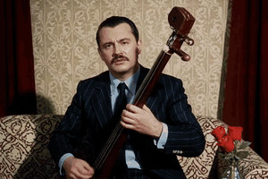
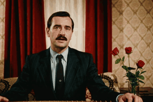
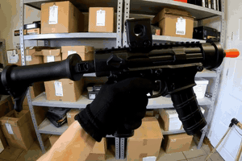
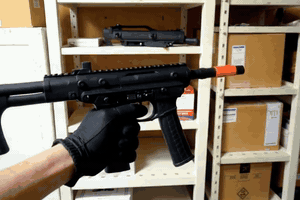
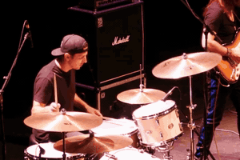
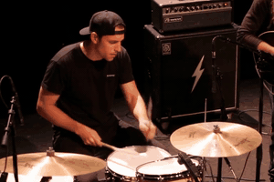
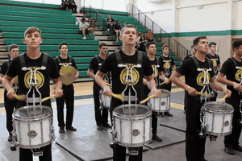
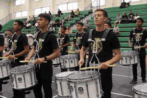

# SyncReward

SyncReward scores audio-visual synchronization of a video clip with a reward in [0, 2].
Stage 1 trains PE-AV audio/video encoders contrastively on real clips; Stage 2 freezes them and
aligns a cross-modal Transformer to human sync ratings.

## Code Structure

```
configs/             paper defaults (stage1 / stage2 / eval), overridable from the CLI
syncreward/
  data.py            video/audio decoding, 0.5 s segmentation, jsonl datasets
  model.py           PE-AV segment encoder + reward Transformer ([REW; V; MOD; A] -> [0, 2])
  losses.py          Stage 1 contrastive loss; Stage 2 regression + ranking loss
  metrics.py         Spearman, Pearson, Kendall, pairwise accuracy, bootstrap CIs
  utils.py           config parsing, distributed helpers
train_stage1.py      Stage 1: contrastive pre-training on real clips
train_stage2.py      Stage 2: human alignment with frozen encoders
evaluate.py          benchmark evaluation (checkpoint or external predictions)
score.py             score your own videos
scripts/             torchrun launch examples
tests/               CPU smoke test
assets/demo/         before/after post-training videos shown below
```

## Demo

Text-to-audio-video generations before and after SyncReward-guided DiffusionNFT post-training,
using matched prompts. Previews are silent GIFs; **click a preview to open the mp4 with audio**
(synchronization can only be judged with sound on).

| Case | Before post-training | After post-training |
| :--- | :---: | :---: |
| 1. Spoken dialogue | [](assets/demo/case1-before.mp4) | [](assets/demo/case1-after.mp4) |
| 2. Singing with a string instrument | [](assets/demo/case2-before.mp4) | [](assets/demo/case2-after.mp4) |
| 3. Handling a toy gun | [](assets/demo/case3-before.mp4) | [](assets/demo/case3-after.mp4) |
| 4. Drummer on stage | [](assets/demo/case4-before.mp4) | [](assets/demo/case4-after.mp4) |
| 5. Drumline | [](assets/demo/case5-before.mp4) | [](assets/demo/case5-after.mp4) |

Before and after clips are different generations from the same prompt, so frames do not
correspond one-to-one. In case 2 the post-trained output drops the instrument named in the prompt,
illustrating the trade-off between synchronization and prompt fidelity discussed in the paper.

## Installation

```bash
pip install -r requirements.txt   # Python >= 3.10, PyTorch, transformers >= 5.0, torchcodec (FFmpeg)
python -m tests.test_smoke        # optional CPU check
```

The encoder is initialized from `[facebook/pe-av-large](https://huggingface.co/facebook/pe-av-large)`
(or a local copy via `--encoder_path`).

## Data

Data and checkpoints will be released with the non-anonymous version.


| File                             | Fields                                     |
| -------------------------------- | ------------------------------------------ |
| Stage 1 list (`.txt` / `.jsonl`) | video path per line, or `{"video_path"}`   |
| Stage 2 train / val (`.jsonl`)   | `{"video_path", "target"}`                 |
| SyncReward-Bench (`.jsonl`)      | `{"video_path", "uid", "model", "target"}` |
| External predictions (`.jsonl`)  | `{"uid", "model", "reward"}`               |


`target` is in [0, 2]: the bias-corrected human consensus for Stage 2, and the mean of up to three
ratings for the benchmark.

## Training

```bash
# Stage 1: contrastive pre-training
torchrun --nproc_per_node=8 train_stage1.py --config configs/stage1.yaml \
    --train_list $DATA/stage1_train.txt --output_dir outputs/stage1

# Stage 2: human alignment (paper: 2 nodes x 8 GPUs)
torchrun --nproc_per_node=8 train_stage2.py --config configs/stage2.yaml \
    --train_jsonl $DATA/stage2_train.jsonl --val_jsonl $DATA/stage2_val.jsonl \
    --stage1_checkpoint outputs/stage1/checkpoint-step-5500 --output_dir outputs/stage2
```

Paper hyperparameters are the defaults in `configs/`; `scripts/` has launch examples.

## Evaluation

```bash
# score SyncReward-Bench with a checkpoint
python evaluate.py --config configs/eval.yaml --checkpoint outputs/stage2/best \
    --data $DATA/syncreward_bench.jsonl --output outputs/eval/predictions.jsonl

# evaluate another metric's predictions
python evaluate.py --predictions other_model.jsonl --data $DATA/syncreward_bench.jsonl
```

Reports Spearman, Pearson, Kendall, MAE, and pairwise accuracy (pairs with target gap >= 0.75;
tied predictions count 0.5), with bootstrap 95% CIs.

## Scoring your own videos

```bash
python score.py --checkpoint outputs/stage2/best a.mp4 b.mp4 --output scores.jsonl
```

## License

To be specified upon de-anonymization. PE-AV weights follow their original license.